> # 保姆级教程：Windows Git 安装全流程及使用方法
## 1️⃣下载安装包
官网下载对应版本安装包
<details>
<summary> 展开内容 </summary>   
  
###  1.下载地址
  - 官方网站：[git-scm.com/download/win](https://git-scm.com/install/windows)
   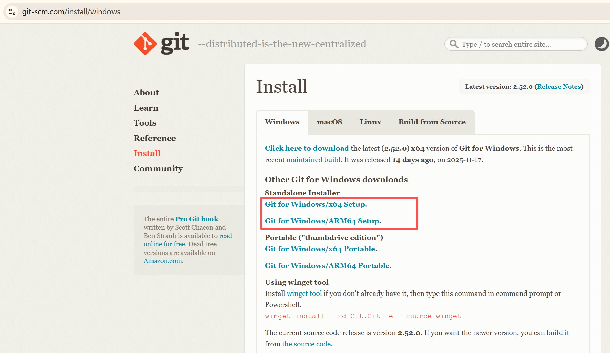
-  下载方式：推荐直接点击页面上的 "Click here to download" 或者 "Git for Windows/x64 Setup" 下载独立的 .exe 安装程序。
   - 注：虽然可以用 Winget 命令行下载，但传统安装包更适合初次配置。
### 2.版本选择 ( x64 vs ARM64 )
  - 绝大多数电脑（Intel/AMD 芯片）：请下载 x64 版本。
  - 少数轻薄本（高通骁龙芯片）或 Mac 虚拟机：请下载 ARM64 版本。
  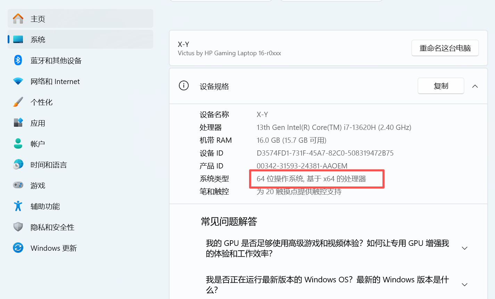
    - 如果不确定，按 Win 键搜索“关于你的电脑”，查看“系统类型”。

</details>
  
## 2️⃣逐步安装
14步安装详细解说
<details>
<summary> 展开内容 </summary>   
  
### 1、初始界面
  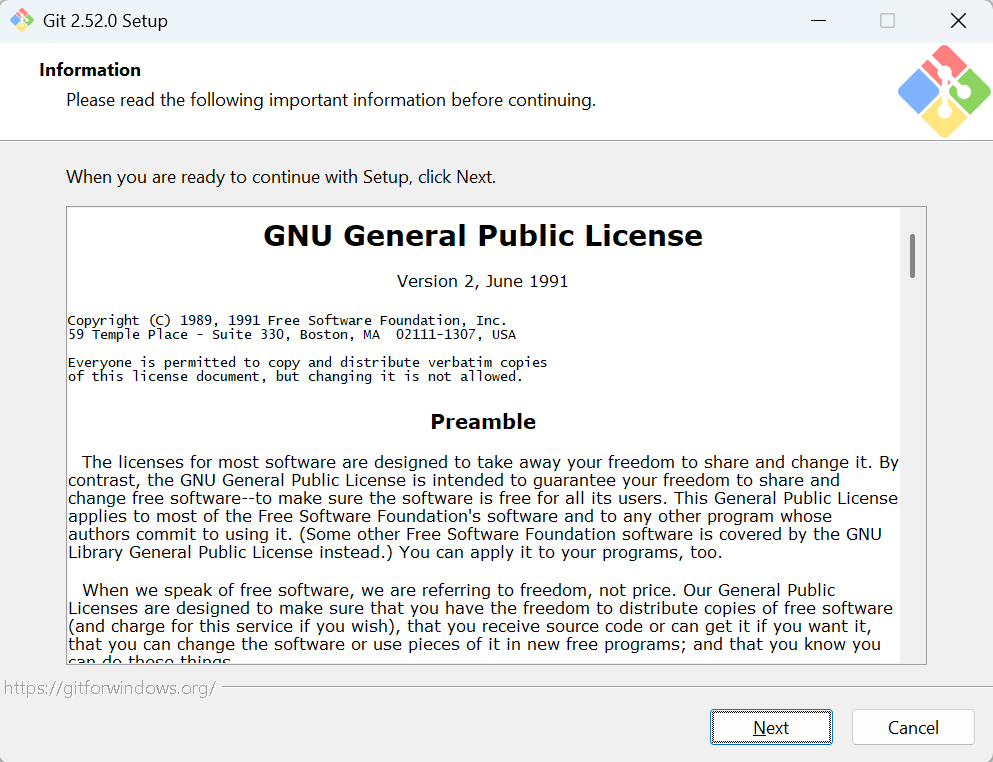
  - 安装初始界面。
### 2、安装路径
  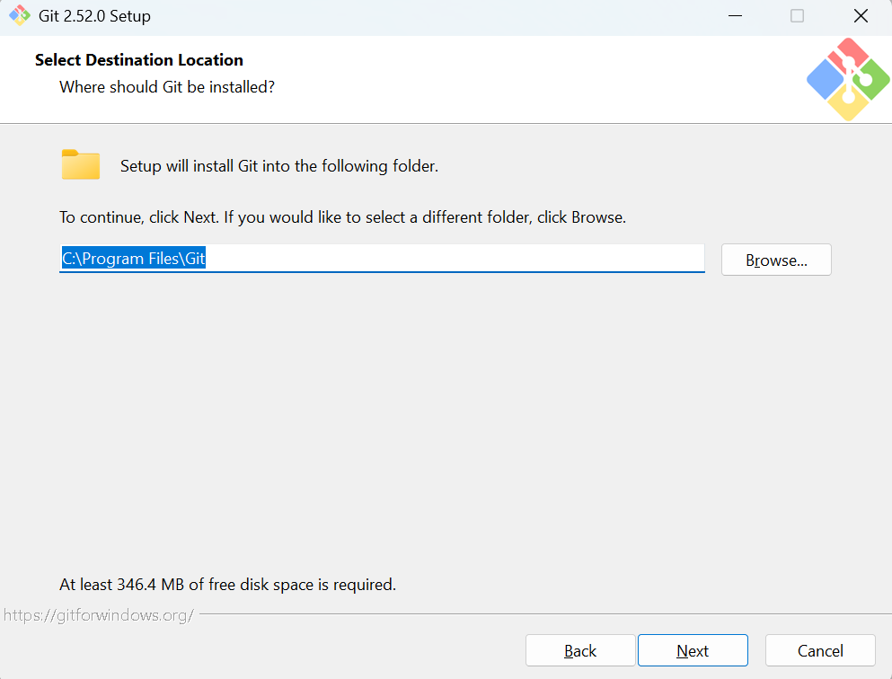
  - 建议：保持默认 (直接点 Next)除非 C 盘空间完全不够，否则建议保持默直接点击「Next」：
    - 1.省事：PyCharm、VS Code 等开发工具，通常都会自动去 C:\Program Files\Git 这个默认位置找 Git。
       如果改到了 D 盘或其他奇怪的文件夹，以后可能还得在 PyCharm 里手动设置一遍 Git 的路径，非常麻烦。
    - 2.避免权限问题：放在默认路径下，Windows 的权限管理最规范，能避免很多莫名其妙的“拒绝访问”错误。
### 3、选择组件
  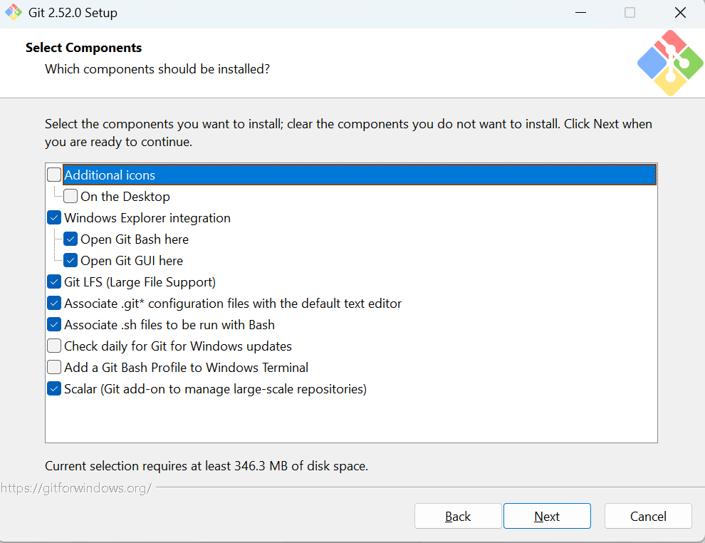
3.1 ✔ Additional icons (附加图标)
   - On the Desktop (在桌面上)
     -  含义：在电脑桌面上创建一个 Git Bash 的快捷方式图标
     - 解读：默认不勾选，看个人喜好
     - 为什么？：一般很少专门双击图标去打开 Git。通常是在某个具体的项目文件夹里点右键打开（见下一项），
       或者直接在编辑器（PyCharm/VS Code）里用。桌面上图标越少越清爽。
       
3.2 ☢ Windows Explorer integration (Windows 资源管理器集成) —— ⭐ 最核心功能
这是一个“大标题”，下面包含两个子选项。它的意思是：把 Git 的功能添加到鼠标右键菜单里。
- ✔ Open Git Bash here (在这里打开 Git Bash)
    - 含义：当进入某个文件夹（比如 Python 项目文件夹），点击鼠标右键，菜单里会出现这个选项。点击它，黑色的命令行窗口就会弹出来，并且自动定位到当前文件夹
    - 解读：必选！ 这是 Git 在 Windows 上最高频的操作入口。没有它，每次打开命令行都得手动输入 cd D:\我的项目\代码 这样长长的路径，非常痛苦
- ✔ Open Git GUI here (在这里打开 Git GUI)
  - 含义：在右键菜单里添加“打开 Git 图形界面”的选项
  - 解读：保留默认。虽然程序员多用命令行，但有时候用图形界面看看代码修改历史（Log）也挺直观的

3.3 ✔ Git LFS (Large File Support) (Git 大文件支持)
   - 含义：LFS (Large File Storage) 是 Git 的一个扩展插件
   - 解读：必选
     - Git 原本设计是用来存代码（纯文本）的，存大图片、视频、音频效率极低，甚至会把仓库撑爆
     - LFS 就是专门帮 Git “开外挂”来高效管理这些大文件的。很多开源项目都依赖它

3.4 ✔ Associate .git configuration files with the default text editor*
   - 翻译：将 .git* 配置文件关联到默认文本编辑器
   - 解读：必选
     - Git 的配置文件通常叫 .gitconfig。勾选这个后，在电脑里看到这种文件，双击它，它就会直接用设置好的编辑器（比如记事本）打开，方便修改配置。如果不勾，双击时系统会一脸懵地问：“要用什么软件打开它？”

3.5 ✔ Associate .sh files to be run with Bash
  - 翻译：关联 .sh 文件，使其通过 Bash 运行
  - 解读：必选
    - .sh 文件是 Linux 系统的脚本（类似于 Windows 的 .bat）
    - 因为装了 Git Bash（它模拟了 Linux 环境），勾选这个后，在 Windows 上双击 .sh 文件，它就能自动跑起来。这对于运行一些跨平台的自动化脚本非常有用

3.6 🚫 Check daily for Git for Windows update
  - 翻译：每天检查 Git for Windows 的更新
  - 解读：不要勾选
    - Git 是一个非常成熟稳定的工具，不需要像手机 App 那样天天更新。勾选这个后，它每天都会联网检查，如果有新版本就会弹窗骚扰。想更新的时候，自己半年一年手动去官网下一次就行

3.7 ❓ Add a Git Bash Profile to Windows Terminal
  - 翻译：将 Git Bash 的配置文件添加到 Windows Terminal 中
  - 解读：看个人喜好（默认不勾）
    - 如果用的是 Win11，或者自己安装了微软的 Windows Terminal（那个可以同时开好几个标签页的帅气终端），勾选这个会让 Git Bash 自动出现在它的下拉菜单里，非常方便
    - 如果不知道 Windows Terminal 是什么，那就别勾，保持默认

3.8 ✔ Scalar (Git add-on to manage large-scale repositories)
  - 翻译：Scalar（用于管理超大规模仓库的 Git 插件）
  - 解读：保留默认
    - 这是微软为了管理像 Windows 源代码那种巨型仓库开发的技术。虽然个人的 Python 项目可能只有几兆大小，完全用不上它，但装了它也不会占什么资源，留着作为“未来扩展”即可

### 4、开始按钮
  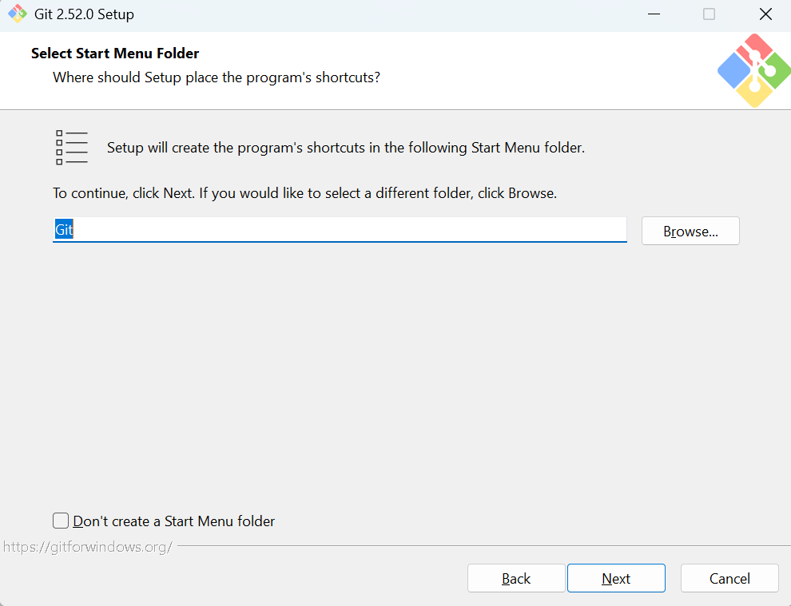
这一步非常简单，不需要任何修改。直接点击「Next」即可。
4.1 标题与问题
   - Select Start Menu Folder
     - 翻译：选择开始菜单文件夹。
     - 含义：当在键盘上按 Win 键（或者点击屏幕左下角的 Windows 图标）弹出菜单时，你希望 Git 的图标出现在哪个文件夹里？
           
4.2 输入框 (Git)
   - 当前内容：Git
   - 解读：
      - 这是默认的名字。安装完成后，开始菜单里就会多出一个叫 "Git" 的文件夹，里面装着 Git Bash（命令行工具）、Git GUI（图形界面工具）等图标。
      - 建议：千万别改。保持默认的 "Git" 是最清晰的，方便以后想用的时候能快速找到它。如果把它改成 "Tool" 或者 "MySoft"，过了两个月可能就忘了 Git 装在哪了

4.3 下方的勾选框
 - Don't create a Start Menu folder
   - 翻译：不要创建开始菜单文件夹
   - 解读：如果勾选了这个，Git 就不会在开始菜单里创建任何快捷方式。想打开 Git Bash 时，就只能去安装目录（C盘）里找文件，或者完全依赖右键菜单。建议不要勾选，留个入口总是好的
   
### 5、选编辑器
  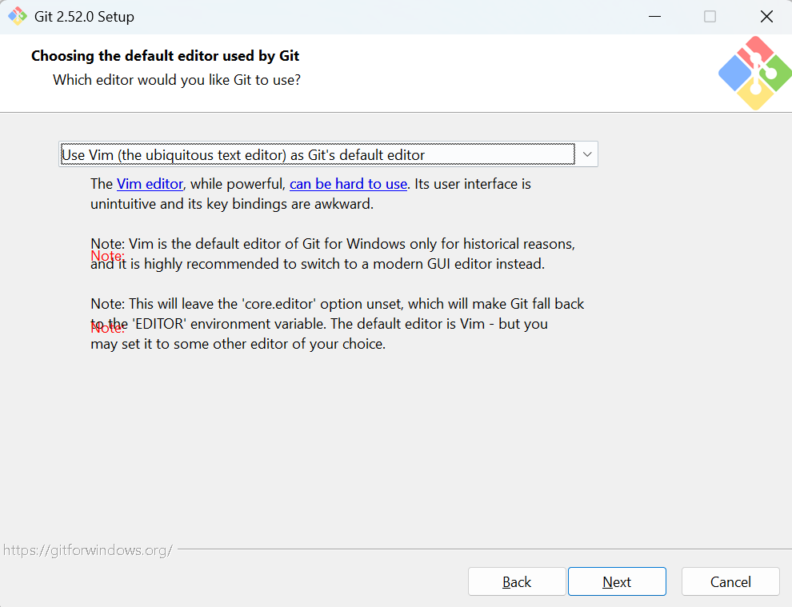
5.1 解读（为什么这一步是个“坑”？）
- 这一步是在问：“当 Git 需要写字（比如写代码提交的备注信息）时，要自动打开哪个软件？”
- 目前的默认选项 (Vim)：
   - 这是一个纯命令行的古老编辑器
   - 它没有鼠标操作
   - 它不能直接打字（需要先按 i 键）
   - 它很难保存退出（需要按 Esc 然后输入 :wq 再回车）
   - 后果：如果不小心保留了这个选项，以后每一次提交代码，屏幕就会突然变黑进入 Vim，如果不知道怎么操作，就会卡死在那里，只能强制关闭窗口

5.2 ☢必须做的操作
  - 千万不要直接点 Next！建议点击那个下拉菜单，换掉 Vim！
  - 根据自身情况（如Python 学习者），推荐两种选择：
    - 首选：Use Visual Studio Code as Git's default editor
    - 如果电脑里装了 VS Code，选这个最舒服。它会弹出一个熟悉的窗口
   - 保底：Use Notepad as Git's default editor
     - 如果没装 VS Code，就选最下面的 Notepad（记事本）。这是 Windows 自带的，虽简陋但绝对不会让你卡住

5.3 选 Notepad (记事本) 或 VS Code后
   - Git 会弹出一个熟悉的、白底黑字的窗口。
   - 可以像写 Word 文档一样打字。
   - 写完点右上角的 X 关闭，或者点“保存”。
   - 结果：Git 接收到文字，顺利完成提交。
  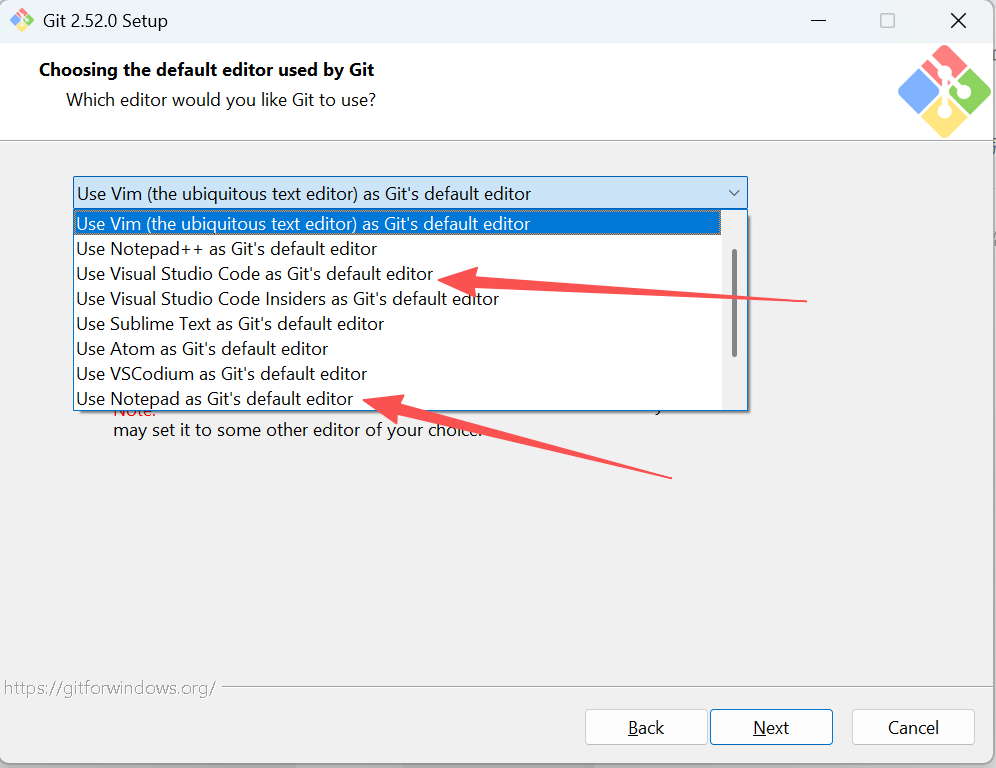
### 6、分支命名
  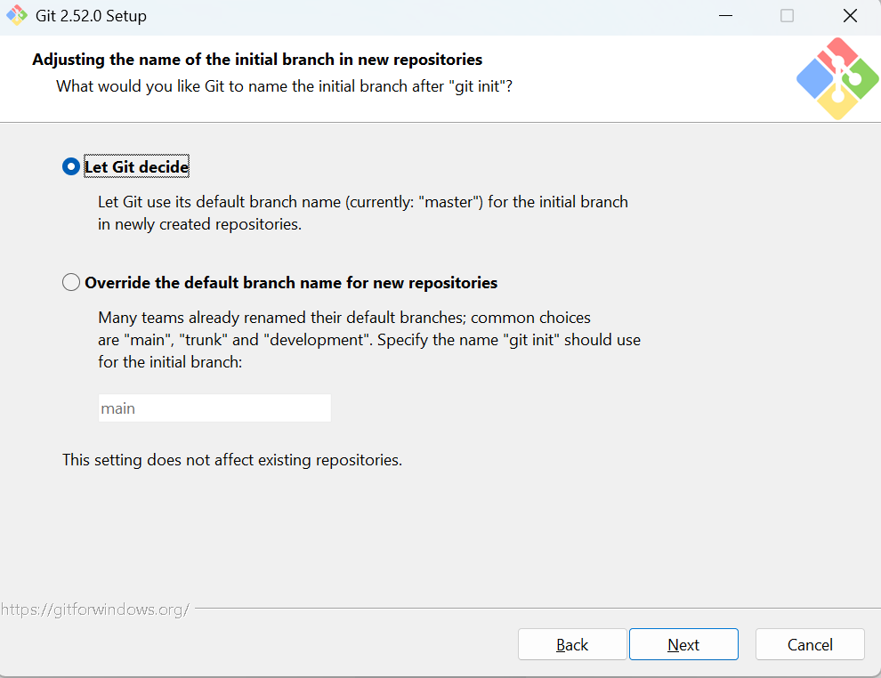
6.1 选项 1：Let Git decide (让 Git 决定)
   - 说明：Let Git use its default branch name (currently: "master")...
   - 翻译：使用 Git 传统的默认名 —— master
   - 解读：这是过去十几年来的老标准

6.2 选项 2：Override the default branch name for new repositories (覆盖默认分支名) —— 推荐选择
   - 说明：Many teams already renamed their default branches...
   - 翻译：许多团队已经更改了默认分支名，常见的选择是 main...
   - 解读：这是目前的国际新标准

6.3  为什么要改选第二个 (main)？
   - 1. 主流趋势：GitHub、GitLab 等主流代码托管平台，现在创建新项目时，默认主分支都叫 main（为了消除 "master/slave" 主从关系的敏感词汇）
     2. 避免混乱：如果在本地选了默认的 master，而在 GitHub 上建的仓库叫 main，当推送代码时，就会发现有两个主分支（一个 master，一个 main），管理起来非常麻烦
     3. 统一标准：直接在安装时设为 main，能让本地和远程仓库保持一致，省去以后改名的麻烦
### 7、配置路径
  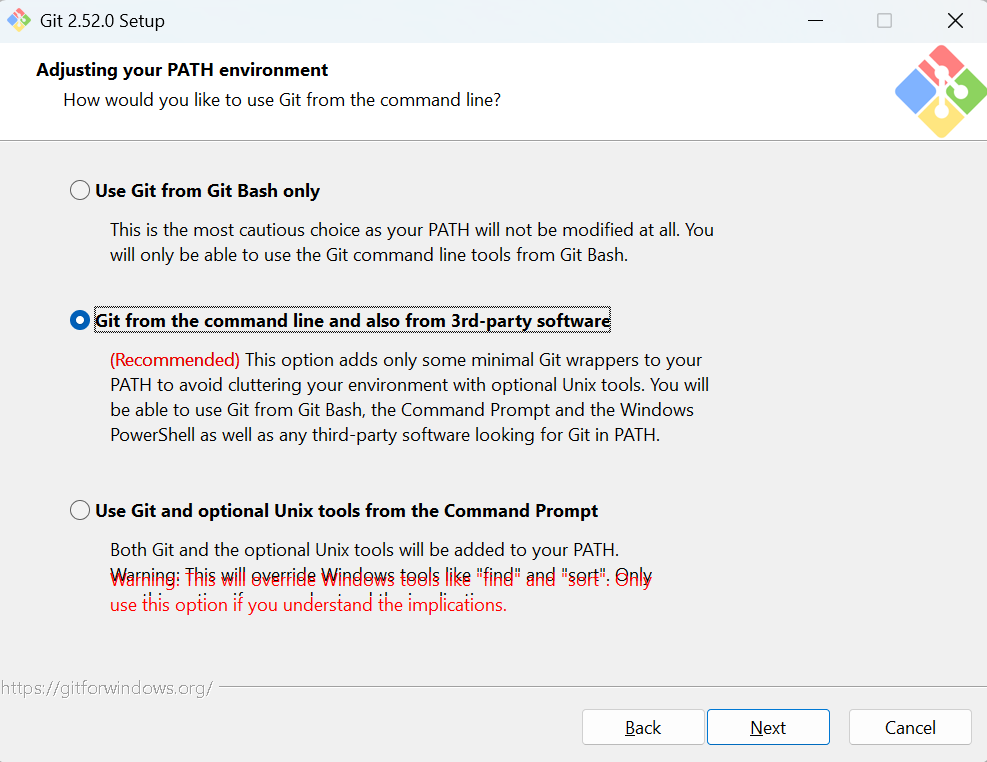
  - 这一步是在设置 PATH 环境变量。简单来说，它决定了可以在电脑的哪些地方输入 git 命令来使用它。
  - 建议：保持默认 (选中间的)，直接点击「Next」即可。这是最推荐、最稳妥的选项

7.1 选项 1：Use Git from Git Bash only (仅在 Git Bash 中使用 Git)
  - 翻译：这是最保守的选择。只能在 Git Bash 这个软件里用 Git，在别的地方（比如 CMD 或 PyCharm）里敲 git 命令，电脑会说“找不到命令”
  - 解读：太不方便了，不要选。这意味着在写 Python 代码时，不能直接在 IDE 的终端里提交代码

7.2 ☢选项 2：Git from the command line and also from 3rd-party software (从命令行和第三方软件使用 Git) —— 推荐选中
  - 说明：(Recommended) This option adds only some minimal Git wrappers...
  - 翻译：(推荐) 此选项只添加最基本的 Git 包装器到环境变量中……可以在 Git Bash、CMD、PowerShell 以及 Python/VS Code 等第三方软件中正常使用 Git。
  - 解读：这是最佳选择。
    - 它让你在任何地方（包括 PyCharm 终端等）都能用 git 命令
    - 同时，它不会干扰 Windows 系统自带的命令

7.3 选项 3：Use Git and optional Unix tools from the Command Prompt (在命令提示符中使用 Git 和可选的 Unix 工具)
   - 警告：Warning: This will override Windows tools like "find" and "sort"
   - 翻译：警告：这将覆盖 Windows 自带的工具，如 "find" 和 "sort"
   - 解读：千万别选这个（除非你是 Linux 专家）
     
### 8、SSH工具
  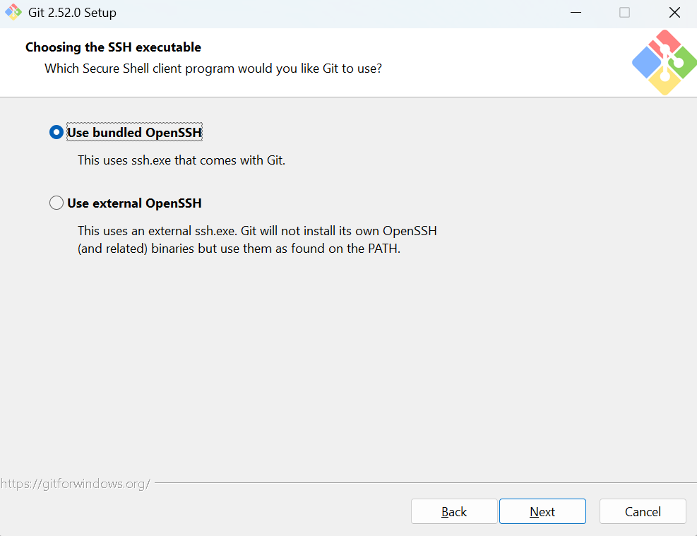
8.1  选项 1： Use bundled OpenSSH 
  - 翻译：使用 Git 自带的 OpenSSH
  - 解释：This uses ssh.exe that comes with Git.（这会使用 Git 安装包里自带的 ssh.exe 程序。）
  - ✔建议：绝大多数用户（包括初学者和开发者）都建议选这个
    - 因为它使用的是 Git 安装包里经过测试的版本，开箱即用
    - 它不会受到电脑环境变量配置的影响，最稳定，不容易出 bug

8.2. 选项 2： Use external OpenSSH
   - 翻译：使用外部的 OpenSSH
   - 解释：This uses an external ssh.exe...（这会使用外部的 ssh.exe。Git 不会安装它自带的 OpenSSH，而是去系统环境变量 PATH 里找现有的）
   - 适用场景：这是给高级用户准备的。如果已经在 Windows 10/11 中手动配置了系统的 OpenSSH，并且希望 Git 共用电脑里那套现成的 SSH 密钥和配置文件，才选这个

### 9、安全验证
  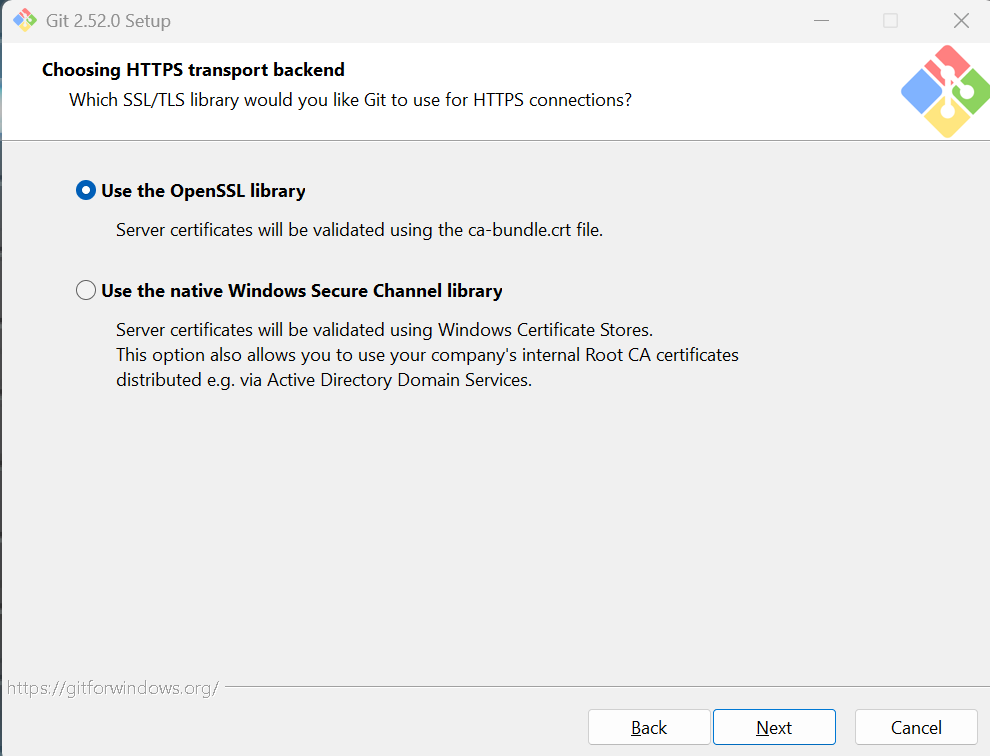
9.1 选项 1：Use the OpenSSL library (使用 OpenSSL 库) —— 推荐选择
  - 说明：Server certificates will be validated using the ca-bundle.crt file
  - 翻译：服务器证书将使用自带的 ca-bundle.crt 文件进行验证
  - 解读：
    - Git 自带了一套安全证书（就像自带了一本「好人名单」）
    - 优点：它完全独立，不受 Windows 系统设置的影响。不管 Windows 系统证书有没有乱七八糟的问题，Git 都能稳定工作。对于个人开发者，这是最稳妥的选择。

9.2 选项 2：Use the native Windows Secure Channel library (使用原生 Windows 安通道库)
  - 说明：Server certificates will be validated using Windows Certificate Stores...
  - 翻译：服务器证书将使用 Windows 系统证书存储进行验证。此选项允许使用公司内部分发的根证书……
  - 解读：
    - Git 会去问 Windows 系统：“这个网站安全吗？”
    - 适用场景：这通常用于大型公司环境。如果在公司上班，且公司电脑强制安装了内部监控证书（用于访问内网），那就必须选这个，否则 Git 会报错。对于个人用户，没必要选。

### 10、换行转换
  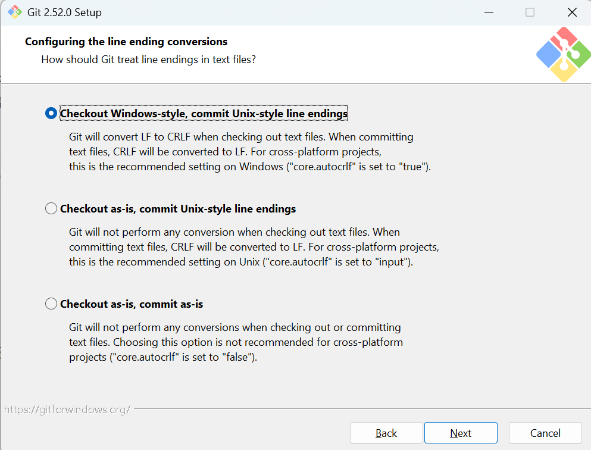
   - 这一步是在设置换行符自动转换。因为 Windows 和 Linux/macOS 系统对“换行”（也就是回车键）的定义是不一样的。

10.1 选项 1：Checkout Windows-style, commit Unix-style line endings (检出时用 Windows 风格，提交时用 Unix 风格) —— 推荐选择
   - 原理：
     - 下载代码时 (Checkout)：Git 会把仓库里的标准格式 (LF) 自动转换成 Windows 习惯的格式 (CRLF)，这样记事本打开才不会乱码
     - 上传代码时 (Commit)：Git 会把电脑上的 Windows 格式 (CRLF) 自动变回标准格式 (LF)，保证仓库里的代码干净、统一
  - 解读：这是一个自动翻译机。它能防止因为用了 Windows，结果把整个团队的代码格式都搞乱了。Windows 用户必选此项。

10.2 选项 2：Checkout as-is, commit Unix-style line endings (检出不转，提交转 Unix
  - 解读：通常是 Unix/Linux 用户选的。Windows 用户选这个可能会导致某些老软件打开文件显示成一行

10.3 选项 3：Checkout as-is, commit as-is (都不转)
  - 解读：完全不处理。除非完全不和别人合作，或者明确知道自己在干什么，否则千万别选，容易造成跨平台协作灾难

### 11、终端窗口
  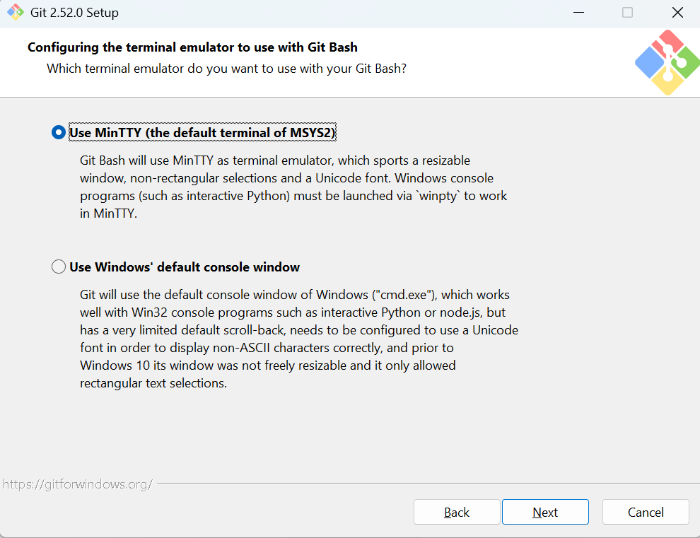
11.1 选项 1：Use MinTTY (the default terminal of MSYS2) —— 推荐选择
   - 翻译：使用 MinTTY（MSYS2 的默认终端）。
   - 解读：
     - 这是一个类 Linux 风格的窗口
     - 优点：界面更好看，支持自由缩放窗口大小，支持像 Word 一样随意的文字选择和复制，字体和配色也更现代。绝大多数开发者都用这个
     - 注意：它提到交互式 Python 需要 winpty，但现在的版本通常兼容性已经很好了，不用太担心

11.2 选项 2：Use Windows' default console window (使用 Windows 默认控制台窗口)
  - 翻译：使用 Windows 的默认控制台窗口 (cmd.exe)
  - 解读：
    - 这就是那个老式的、黑底白字的 Windows CMD 窗口
    - 缺点：滚动查看历史记录很受限，复制粘贴操作很反人类（矩形选择），而且字体支持也不如 MinTTY 好。除非有极特殊的怀旧情结或兼容性需求，否则别选这个

### 12、拉取方式
  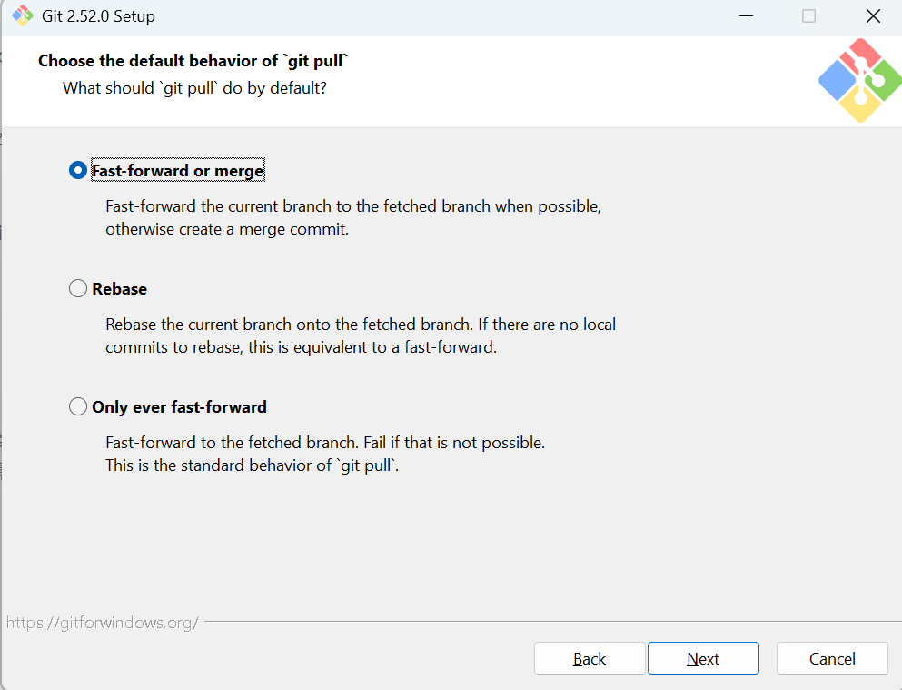
  - 这一步是在设置 git pull（拉取代码）的默认行为。简单来说就是：当别人的代码更新了，你把新代码拉取到本地时，Git 应该怎么把两份代码合在一起？
    
12.1 选项 1：Fast-forward or merge (快进或合并) ——  推荐选择
   - 翻译：如果可能，就进行“快进”；否则，创建一个“合并提交”
   - 解读：这是 Git 的经典标准模式
     - 快进 (Fast-forward)：想象在追剧，落后了 3 集。补看这 3 集（拉取代码），进度条直接走到最新，这叫“快进”
     - 合并 (Merge)：想象和朋友同时写小说。写了第 3 章，他改了第 1 章。这时候不能直接快进，需要把两人的修改“融合”在一起，这叫“合并”
     - 结论：这个选项能自动处理这两种情况，最安全、最符合直觉

12.2 选项 2：Rebase (变基)
   - 翻译：将当前分支变基到拉取的分支之上。
   - 解读：
     - 这是一种高级技巧，它会修改你的提交历史，让记录看起来像一条直线
     - 缺点：如果有代码冲突，解决起来比上面那种稍微麻烦点，新手容易把代码搞丢或搞乱

12.3 选项 3：Only ever fast-forward (仅允许快进)
   - 翻译：只允许快进。如果不能快进（有分叉），就直接报错失败
   - 解读：这是最严格的模式，通常是给机器（自动化脚本）用的，人类用起来会很痛苦，动不动就报错

### 13、记住密码
  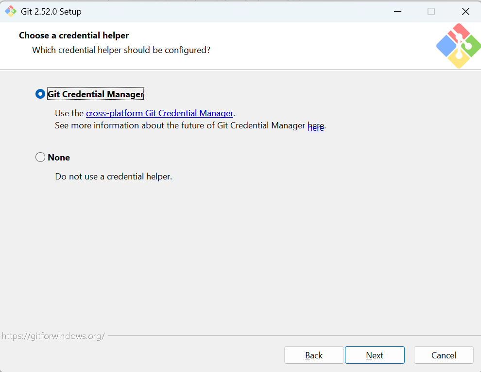
 - 这一步是在设置 凭据管理器（也就是帮你自动记密码的工具）。简单来说就是：当向 GitHub 推送代码时，Git 该怎么保存账号和密码，从而不用每次都手动输入？

13.1 选项 1：Git Credential Manager (Git 凭据管理器) —— 强烈推荐选择
  - 翻译：使用跨平台的 Git 凭据管理器。
  - 解读：这是一个“神器”
    - 作用：当第一次连接 GitHub/GitLab 时，它会弹出一个网页登录。只要登录这一次，它就会把你的“通行证”加密保存在电脑里
    - 好处：以后每天推送代码（git push）时，它会自动帮你填密码，完全无感，不需要再操心

13.2选项 2：None (无)
   - 翻译：不使用凭据助手。
   - 解读：
     - 后果：这意味着 Git 会变成“健忘症”。你每一次想上传代码，它都会冷漠地弹窗问你：“你是谁？密码是多少？”
     - 体验：极其折磨人，除非是为了测试或者有特殊的安全洁癖，否则千万别选

### 14、配置性能
  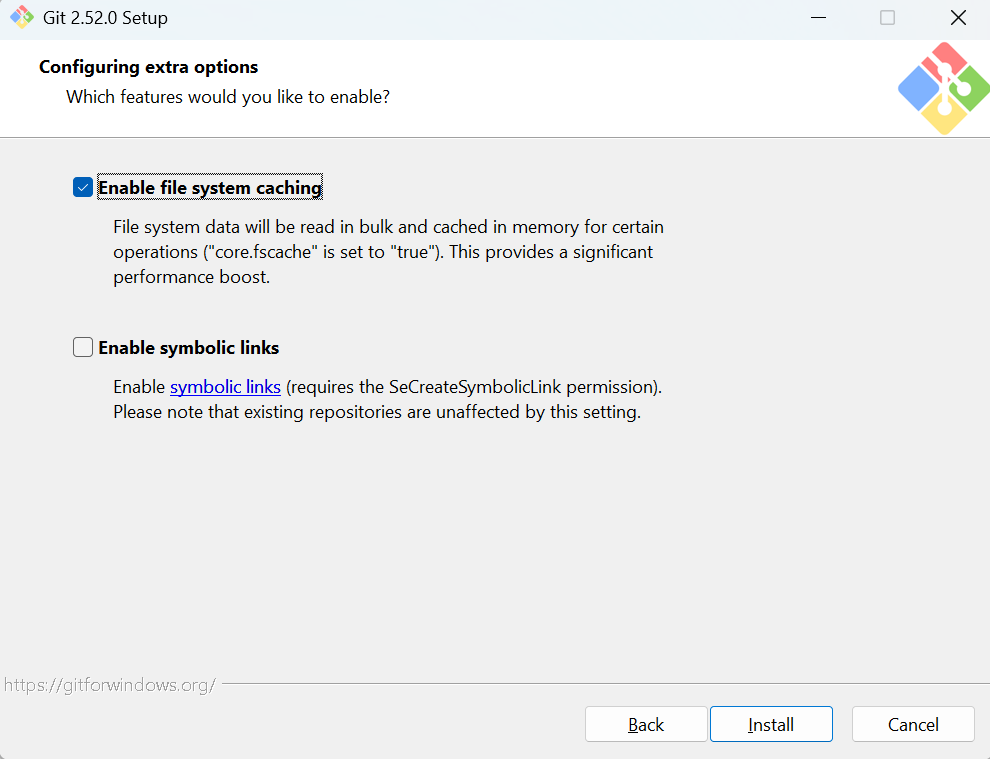
  - 这是安装向导的最后一步（配置性能选项）。
    
14.1 选项 1：Enable file system caching (启用文件系统缓存) —— 默认勾选 & 必须保留
   - 翻译：批量读取文件系统数据并缓存在内存中……这将提供显著的性能提升。
   - 解读：
     - 作用：给 Git “加速”。
     - 原因：Git 在 Linux 上运行得很快，但在 Windows 上，因为文件系统（NTFS）的特性，读取大量小文件会比较慢。
     - 后果：如果不勾选这个，在操作大项目时（比如运行 git status），电脑可能会卡很久。所以务必勾选。

14.2 选项 2：Enable symbolic links (启用符号链接) —— ⬜ 默认不勾 & 建议保持
   - 翻译：启用符号链接（需要 SeCreateSymbolicLink 权限）。
   - 解读：
     - 含义：符号链接有点像 Windows 的“快捷方式”，但在编程中更高级
     - 坑点：在 Windows 上开启这个功能比较麻烦，通常需要管理员权限才能创建链接，而且很多 Windows 软件对它的支持并不完美
     - 建议：除非非常确定Python 项目里用到了跨平台的符号链接，否则不要勾选，省得以后报一堆“权限不足”的错误
</details>
       
##  ❗关键步骤总结 
 双击安装包运行，大部分步骤可以直接点 "Next"，但以下 4 个关键节点 请按建议修改，否则后续使用会很麻烦。

 <details>
<summary> 展开内容 </summary>  
   
##### 关键点 1：选择编辑器 (Choosing the default editor)
  - 默认选项：Vim (难度极高，新手噩梦)。

   ⚠️推荐修改为：(如果装了) 或 Notepad (记事本)。
   ```ruby 
   Visual Studio Code
   ```
  - 理由：Git 需要输入提交信息时会唤起这个软件。Vim 操作反人类，换成记事本或 VS Code 能让你轻松输入文字并保存。

##### 关键点 2：初始分支名 (Adjusting the name of the initial branch)
  - 默认选项：Let Git decide (默认叫 master)。

   ⚠️推荐修改为：
   ```ruby 
   Override the default branch name...
  ```
  并在框内确认填入`main`
  - 理由：GitHub、GitLab 等主流平台现在新建项目默认都叫 main。在本地改好，能避免推送代码时出现“两个主分支”的混乱。

##### 关键点 3：环境变量 PATH (Adjusting your PATH environment)
  ⚠️推荐选择：第二个选项
  ```ruby
  (Git from the command line and also from 3rd-party software)。
  ````
   - 理由：这样不仅能在 Git Bash 里用 Git，还能在 PowerShell、CMD、PyCharm 自带终端里畅通无阻地使用 Git 命令。
   - 避坑：千万别选第三个（会覆盖 Windows 自带命令），也别选第一个（只能在 Git Bash 用）。

##### 关键点 4：HTTPS 传输后端 (Choosing HTTPS transport backend)
  - 默认选项：Windows Secure Channel。
    
   ⚠️推荐修改为：(第一个选项)
   ```ruby 
   Use the OpenSSL library
   ```
  - 理由：OpenSSL 独立于 Windows 系统证书，更加稳定，不容易因为公司策略或系统更新导致 Git 连不上网。

##### 除了上面 4 点，其余页面一路点击 Next 即可。以下是这些默认选项的含义速览：

- 📖1.Select Components（组件选择）：默认即可。
  - 进阶建议：如果用 Windows Terminal，可以勾选 "Add a Git Bash Profile to Windows Terminal"。
- 📖2.SSH Executable：选 Use bundled OpenSSH（使用自带的 SSH，最稳）。
- 📖3.Line Ending（换行符）：选 Checkout Windows-style, commit Unix-style（自动处理 Windows/Linux 换行符差异，防乱码必选）。
- 📖4.Terminal Emulator：选 Use MinTTY（更好看的终端窗口）
- 📖5.git pull behavior：选 Fast-forward or merge（最标准的拉取合并模式）
- 📖6.Credential Helper：选 Git Credential Manager（帮记住密码，不用每次推送都输）
- 📖7.Extra Options：勾选 Enable file system caching（开启缓存，提升速度）
- 📖8.最后点击 Install，等待安装完成

</details>

## 3️⃣验证安装
安装完成后，需要确认 Git 是否已经准备好工作。

 <details>
<summary> 展开内容 </summary>  
   
#### 1.按下 Win + R，输入 cmd 并回车。
#### 2.在黑窗口中输入以下命令并回车：
```bash
 git --version
  ```
#### 3.如果屏幕显示类似的版本表示安装成功！
```bash 
git version 2.52.0.windows.1 
```   
  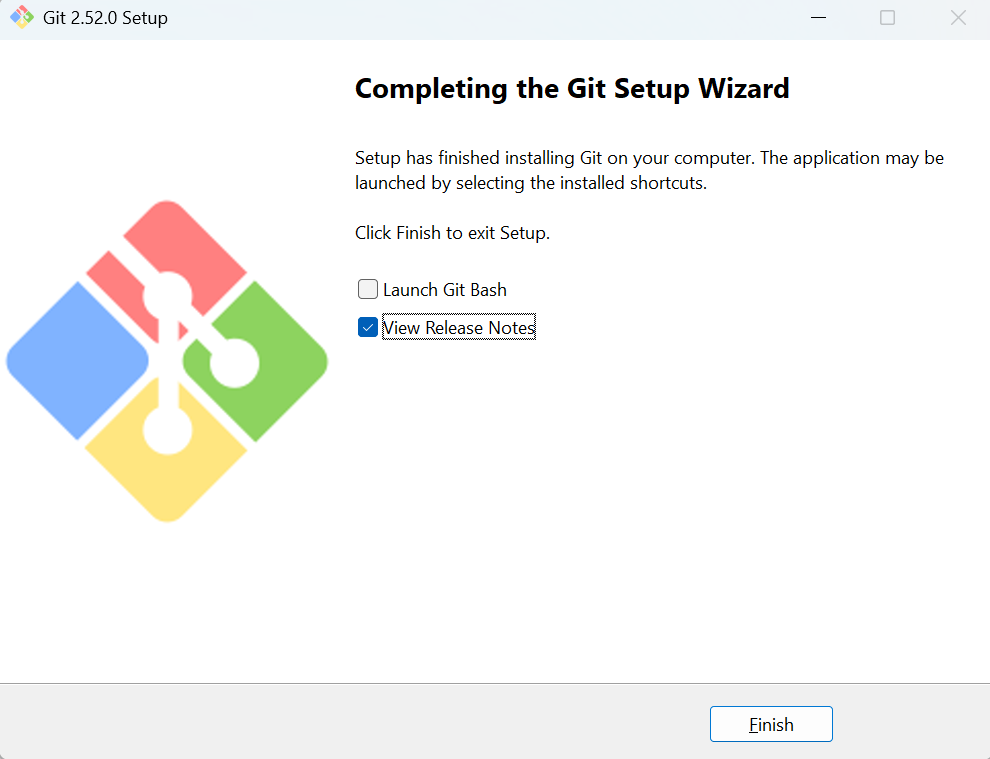
</details>
  
## 🥚最后的彩蛋：安装后的第一件事
  很多新手安装完后直接去克隆代码，结果报错。这是因为还没告诉 Git “你是谁”。
 <details>
<summary> 展开内容 </summary>  
   
 - 请在命令行（CMD 或 PowerShell）中依次输入以下两行代码（把引号里的内容换成你的）：
```
# 告诉 Git 你的名字（出现在代码提交记录里）
git config --global user.name "你的英文昵称"
# 告诉 Git 你的邮箱（GitHub 账号邮箱）
git config --global user.email "你的邮箱@example.com"
``` 
 - 配置完成！现在可以愉快地开始你的版本控制之旅了
</details>
